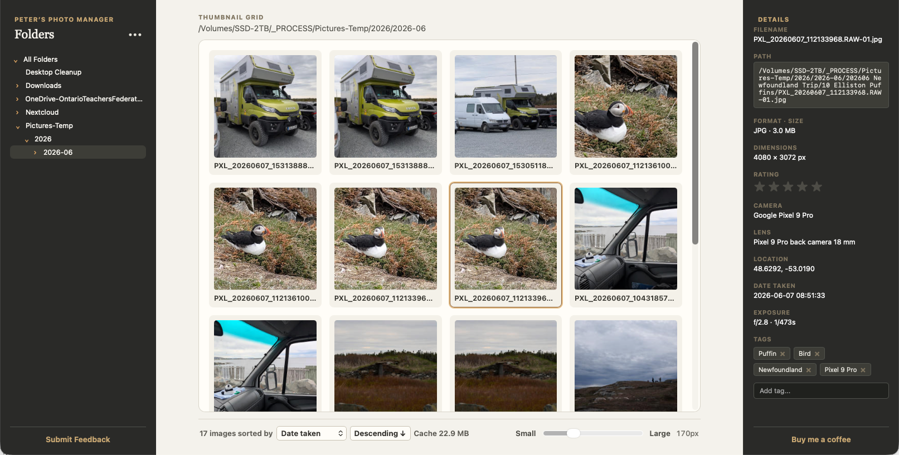

# Peter’s Photo Manager



Peter’s Photo Manager is a local-first desktop photo manager for macOS and Windows. It is intended to work with photographs in their existing folders rather than requiring import into a proprietary library.

## Current Status

Current version: `0.4.0-alpha.2` (development).

> [!WARNING]
> The new editor save workflow is experimental. Do **not** trust it as the sole copy of an important photograph: verify the rendered output and retain an independent backup of every original. Re-editing saved images does not yet restore their prior slider settings, and rendered pixels do not yet reliably match the editor preview.

> [!IMPORTANT]
> * **Download Release Installers**: Production build setup files (such as `.dmg` for macOS) are available in the [exports/](exports/) directory.
> * **Submit Issues**: If you run into bugs or have feature suggestions, please submit them on the [GitHub Issues](https://github.com/pbeens/peters-photo-manager/issues) page.
> * **Support Development**: If you like this app or want to support its development, please consider [buying me a coffee](https://buymeacoffee.com/pbeens).

The application supports multiple local root folders, an image-focused folder tree, an All Folders view, JPEG/PNG/WebP scanning, cached thumbnails with a visible cache-size indicator, a persistent local SQLite catalogue, instant basic Details-panel updates, manual photo tags with autocomplete, and a cached-first viewer that loads the original image in the background. It also includes an initial Lightroom-inspired editor. Its save workflow is experimental; JPEG/PNG/WebP output is available, while RAW-to-DNG output requires an optional locally installed Adobe DNG SDK toolchain. Thumbnail size and sorting preferences persist between launches. Viewer navigation updates in place with the selected thumbnail and details.

Albums, undo/redo, crop, restore-original, broader editing controls, and AI features have not been implemented yet.

The application is an early development build. Releases use Semantic Versioning with prerelease labels such as `alpha.1`.

## Planned Technology

- Rust for application logic
- Tauri 2 for the desktop application shell
- TypeScript for the user interface
- JPEG, PNG, and WebP support in the first milestone

## Repository Guide

- [`AGENTS.md`](AGENTS.md): instructions for contributors and coding agents
- [`tasks.md`](tasks.md): current work, next steps, and open questions
- [`software-specification.md`](software-specification.md): product direction and phased requirements
- [`CHANGELOG.md`](CHANGELOG.md): version history and known limitations
- [`project-docs/`](project-docs/): documentation index
- [`project-docs/user-manual.md`](project-docs/user-manual.md): current user functionality
- [`project-docs/development/`](project-docs/development/): current phase and backlog notes
- [`project-docs/decisions/`](project-docs/decisions/): architectural decisions
- [`tests/fixtures/`](tests/fixtures/): controlled test-photo collections

## Development Prerequisites

Development requires:

1. Rust and Cargo installed with [rustup](https://rust-lang.org/tools/install/).
2. Tauri’s [platform prerequisites](https://v2.tauri.app/start/prerequisites/).
3. Node.js LTS and npm from [nodejs.org](https://nodejs.org/en/download).
4. Git.

On macOS, the required Xcode Command Line Tools can be installed or checked with:

```bash
xcode-select --install
```

If macOS reports that the Command Line Tools are already installed, this prerequisite is satisfied.

On Windows, Tauri requires Microsoft C++ Build Tools and Microsoft Edge WebView2. See the official Tauri prerequisites before building there.

## Initialize or Check Out the Project

The repository already contains the generated desktop application in `apps/desktop/`. Do not run `npm create tauri-app` again unless you are intentionally creating a fresh application.

The name used during scaffolding was the internal package name:

| Purpose                  | Value                           |
| ------------------------ | ------------------------------- |
| Package/project name     | `peters-photo-manager`        |
| Application identifier   | `com.peterbeens.photomanager` |
| User-facing product name | Peter’s Photo Manager          |

Rust and npm package names must use lowercase letters, numbers, and hyphens. The package name is not the same as the display name.

## Run the Development Application

Open Terminal and run these commands from the repository root:

```bash
cd apps/desktop
npm install
npm run tauri dev
```

`npm install` downloads the frontend dependencies listed in `package.json`. It is safe to run again when dependencies change. `npm run tauri dev` starts the frontend, compiles the Rust/Tauri code, and opens the desktop application.

To test the current build, open **••• Folder options**, select **Add folder**, and choose a folder containing supported images. Click a thumbnail to show its file details, then double-click it to open the viewer. The viewer displays the cached thumbnail immediately and replaces it with the original file when ready. Select **Edit**, make an adjustment, then choose **Save**; pick an original-retention strategy from **•••** first. Right-click a folder to open it in the system file manager, copy its path, or remove that exact folder from the catalogue; nested-folder removal excludes only that selected folder from later scans. Original photographs are never moved or changed by folder removal.

Press `Control-C` in Terminal to stop the development application.

## Build and Test Workflow

Run these commands from `apps/desktop/`:

```bash
# TypeScript and frontend production build
npm run build

# Rust tests
cd src-tauri
cargo test

# Rust formatting check
cargo fmt -- --check

# Rust linting
cargo clippy --all-targets --all-features -- -D warnings

# Return to the desktop app directory and create and export a macOS DMG
cd ..
npm run build:app

# On macOS, verify the application bundle without creating a DMG
npm run tauri build -- --bundles app
```

Packaged files are written under `apps/desktop/src-tauri/target/release/bundle/` and the DMG is copied to `exports/`. On macOS, the `.app` bundle can be verified independently with the `--bundles app` command. DMG creation may require local Finder and disk-image support; if that step fails while the `.app` succeeds, the application has still compiled successfully.

These are local build artifacts and should not be committed as source files.

## Versioning and Releases

Releases will use semantic versioning:

- `MAJOR`: incompatible public changes
- `MINOR`: backward-compatible features
- `PATCH`: backward-compatible fixes
- pre-release labels such as `alpha`, `beta`, and `rc` identify testing builds

Every public test build should document its version, supported platforms, known limitations, and changes since the previous release. Release packaging must be tested on macOS and Windows, or clearly marked when one platform remains pending.

The current version is `0.4.0-alpha.2`. When changing the application version, keep the version values synchronized in:

- `apps/desktop/package.json`
- `apps/desktop/src-tauri/Cargo.toml`
- `apps/desktop/src-tauri/tauri.conf.json`

Submit feedback and report issues on the [GitHub Issues](https://github.com/pbeens/peters-photo-manager/issues) page.

## License

The project license has not yet been selected. A license file will be added after that decision is confirmed.

## Third-Party Software Credits

This project makes use of the following third-party software:

- **`exiftool-rs`** developed by Le-Syl21 ([GitHub repository](https://github.com/Le-Syl21/exiftool-rs)), licensed under the GPL-3.0-or-later license. It is a pure-Rust port and reimplementation of ExifTool that reads, writes, and edits EXIF/XMP metadata natively on all target platforms.

## Roadmap

1. Repository and architecture setup
2. Folder browser and scan management
3. Thumbnail grid
4. Basic image viewer
5. Catalogue and metadata enhancements
6. Ratings, tags, file operations, albums, and export
7. Local AI capabilities

Future features are not commitments for the current milestone. See the specification and [`tasks.md`](tasks.md) for current scope.
